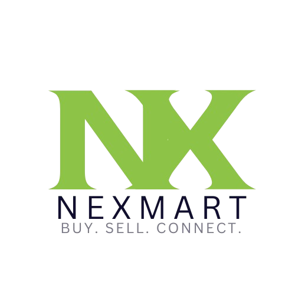

<p align="center">
  
</p>

<h1 align="center">Nex Mart</h1>

<p align="center">
  Marketplace MVP
</p>

<p align="center">
  <a href="nextgenmart.netlify.app">Live Demo</a>
</p>

---

## 📖 Overview

Nex Mart is a marketplace MVP that enables users to browse products, create seller accounts, upload product listings, and manage their inventory through a simple and responsive interface. The project focuses on demonstrating a complete buying and selling workflow using Firebase and React.

---

## ✨ Features

- User authentication
- Buyer and seller accounts
- Product listings
- Product image uploads
- CRUD operations
- Marketplace browsing
- Responsive design
- Real-time Firebase database
- Clean and modern UI

---

## 🎯 Problem

Small businesses and independent sellers often rely on social media platforms to sell products, making it difficult to organize listings, manage inventory, and provide customers with a structured shopping experience.

---

## 💡 Solution

Developed a marketplace MVP where users can register as sellers, upload product images, manage listings, and sell products through a responsive web application. Firebase Authentication and Firestore provide secure user management and real-time data synchronization.

---

## 🚀 Result

Delivered a functional marketplace demonstrating complete buyer and seller workflows, including authentication, product management, image uploads, and real-time database operations.

---

## 🛠 Tech Stack

- React
- Vite
- Tailwind CSS
- Firebase
- Firestore
- Firebase Authentication
- Firebase Storage
- Lucide React

---

## 📚 Engineering Insights

- Implementing Firebase Authentication
- Building CRUD operations with Firestore
- Uploading and managing product images
- Designing buyer and seller workflows
- Managing application state across multiple pages
- Building a complete marketplace MVP using React

---

## 📂 Folder Structure

```text
Nex-Mart/
│
├── public/
│
├── src/
│   ├── assets/
│   ├── components/
│   ├── context/
│   ├── firebase/
│   ├── hooks/
│   ├── pages/
│   ├── services/
│   ├── utils/
│   ├── App.jsx
│   ├── main.jsx
│   └── index.css
│
├── package.json
├── vite.config.js
└── README.md
```

---

## ⚙️ Installation

Clone the repository

```bash
git clone https://github.com/maheenfarooqui/nexmart
```

Install dependencies

```bash
npm install
```

Run the development server

```bash
npm run dev
```

Create a production build

```bash
npm run build
```

---

## 🌐 Live Demo

nextgenmart.netlify.app

---

## 👩‍💻 Author

**Maheen Zuhra**

Frontend Developer

- Portfolio: https://maheen-zuhra-portfolio.vercel.app/
- LinkedIn: https://www.linkedin.com/in/maheen-zuhra/
